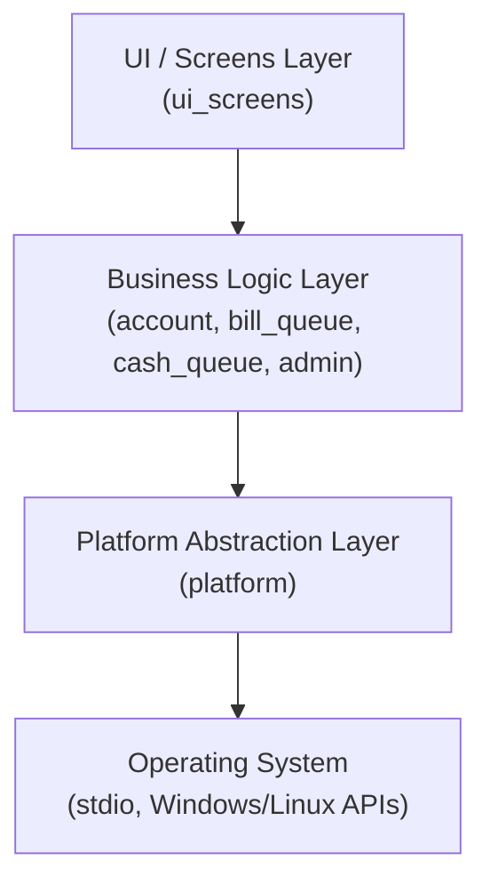
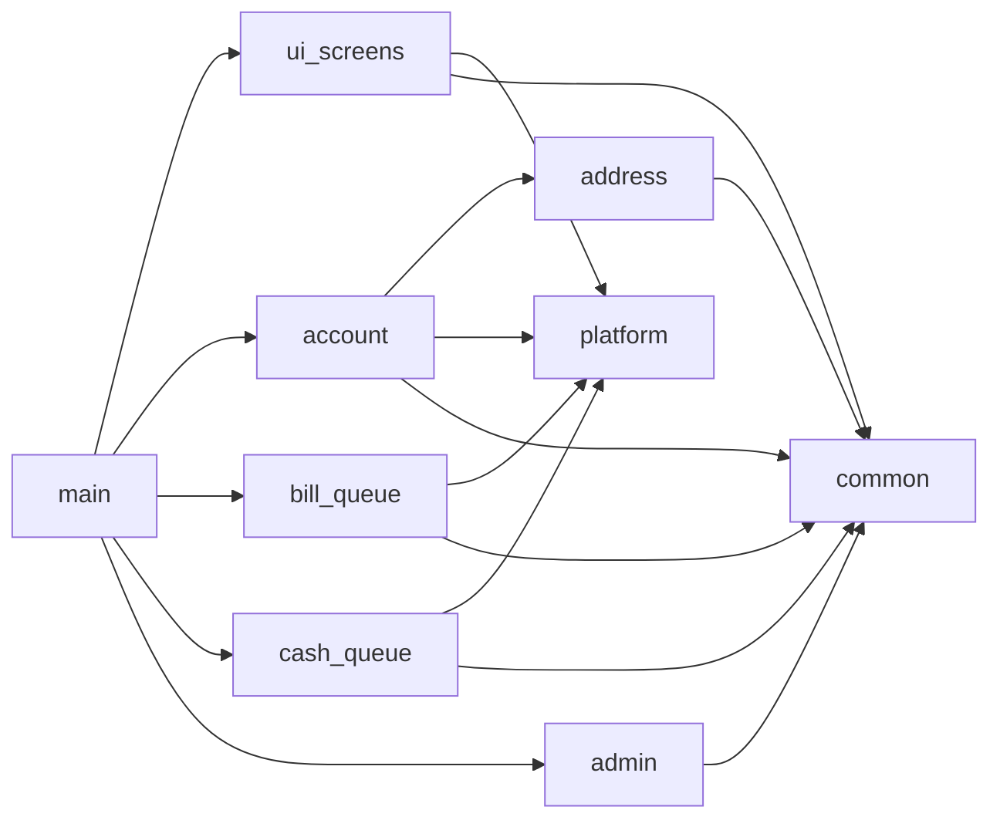
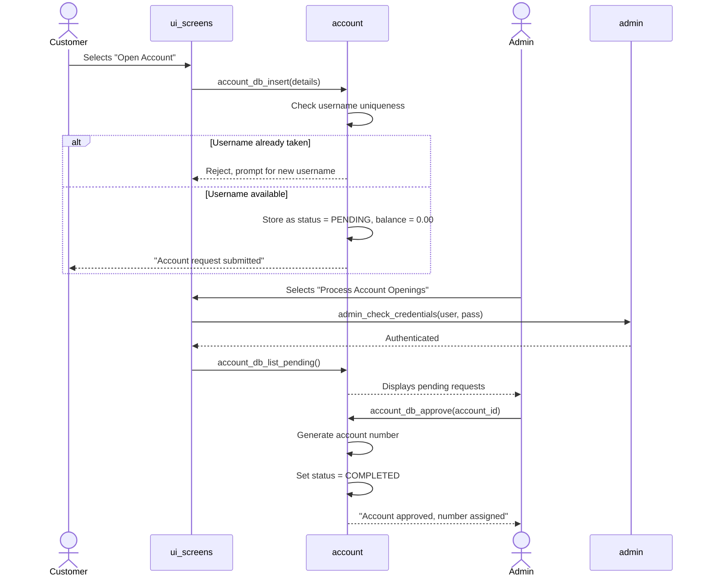

# High-Level Design (HLD) — Banking System

**Document Status:** Draft
**Related Requirements:** All SRS items in `requirements/BRS_SRS.xlsx`
**Traceability:** See `traceability/RTM.xlsx` for the full SRS → Module mapping

---

## 1. Architecture Overview

> As noted in `docs/README.md`, this project is a single-binary, single-process
> application. Industry practice for systems at this scale is to fold the
> Software Architecture Document (SAD) into the HLD rather than maintain it
> as a separate artifact — that is what this section does.

### 1.1 Architecture Style

The system is a **modular monolith**: one executable, one process, no
network calls, no database — all data lives in memory for the duration of
the program's run (matching the original prototype's scope; persistence is
out of scope for this version).

Internally, the monolith is split into independent, single-responsibility
**modules**, each with its own header/source file pair. Modules communicate
only through well-defined function interfaces (no module reaches into
another module's internal data directly) — this is what makes the system
"modular" rather than one large file.

### 1.2 Layering

- **UI / Screens Layer** — displays menus, reads raw user input, has no
  knowledge of business rules (e.g., it doesn't know what a valid PIN looks
  like, it just collects the input and hands it to the business logic layer).
- **Business Logic Layer** — owns all rules from the SRS (balance checks,
  PIN validation, account approval workflow, queue processing order). This
  layer never calls OS-specific functions directly.
- **Platform Abstraction Layer** — the *only* place that touches
  OS-specific behavior (clearing the screen, waiting for a keypress). Every
  other layer calls through this layer's functions instead of calling the
  OS directly.
- **Operating System** — Windows or Linux, whatever the platform layer is
  compiled for.

This layering is what satisfies **SRS-025** (portability, no OS-specific
API in core logic) — only `platform.c` would need a different
implementation to support a new OS; everything above it is untouched.

### 1.3 Key Architectural Decisions

| Decision | Rationale |
|---|---|
| **Fixed-size `char[]` buffers instead of dynamic strings** | C has no built-in dynamic string type; using fixed, clearly-named buffers (e.g., `MAX_NAME_LEN`) avoids manual heap-string management and keeps memory ownership simple and auditable — standard practice for MISRA-oriented C. |
| **Struct + free-function modules instead of C++-style classes** | C has no classes. Each module uses the common C idiom of a struct representing the "object" and free functions that take a pointer to that struct as their first parameter (the "opaque handle" pattern), e.g. `account_db_insert(AccountDatabase *db, ...)`. |
| **`malloc`/`free` with mandatory NULL-checks** | Replaces C++'s `new`/`delete`. Every allocation is checked before use — a hard requirement for MISRA compliance and for professional C generally. |
| **No dynamic memory where avoidable** | Where a fixed maximum is reasonable (e.g., address fields), fixed-size struct members are preferred over heap allocation, reducing failure surface. |
| **All OS-specific calls isolated to `platform.c`** | Directly satisfies SRS-025 (portability, no OS-specific API in core logic). |
| **`goto`-driven menu loops replaced with `do { } while()`** | The original used labeled `goto` for every menu; this is replaced with structured loops — equivalent behavior, but readable and MISRA-friendly. |
| **Money represented as `double`** | Kept as a floating type for simplicity, matching this project's learning/demo scope rather than a real financial system (see design note below). |

> **Design Note on Money Representation:** In a real production banking
> system, currency is typically stored as integer minor units (e.g., paise)
> to avoid floating-point rounding error. For this project's scope (a
> learning/CI-pipeline demonstration, not a real financial system), `double`
> is retained for simplicity and readability. This is a deliberate,
> documented trade-off, not an oversight.

---

## 2. Module Breakdown

No circular dependencies exist: `common` and `platform` sit at the bottom
of the graph and depend on nothing else in the system; every other module
depends only on modules below it.

### 2.1 `platform` — Platform Abstraction

**Responsibility:** Isolate every OS-specific call behind a portable
interface.

| Function (planned) | Purpose |
|---|---|
| `platform_clear_screen(void)` | Clears the terminal/console. |
| `platform_wait_for_keypress(void)` | Pauses until the user presses a key. |
| `platform_get_current_time(SystemTime *out)` | Fills a portable time struct (replaces direct `time()`/`localtime()` use scattered through the original). |

**Satisfies:** SRS-025.

### 2.2 `common` — Shared Types & Constants

**Responsibility:** Definitions shared across every other module — the
`Money` typedef, `MAX_*` buffer-length constants, shared error/status enums.

**Satisfies:** SRS-026 (supports modular organization); no direct
functional SRS (foundational/support module).

### 2.3 `address` — Postal Address

**Responsibility:** Represents a customer's home address (house number,
town, street number, city) and provides set/display/accessor functions.

**Satisfies:** Supports SRS-001 (account opening captures home address).

### 2.4 `bill_queue` — Bill Payment Queue

**Responsibility:** FIFO queue of bill payment requests (electricity, gas,
internet). Enqueue, dequeue, view full queue, view front.

**Satisfies:** SRS-018, SRS-019, SRS-020, SRS-021, SRS-022.

### 2.5 `cash_queue` — Withdraw/Deposit Queue

**Responsibility:** FIFO queue of cash withdrawal/deposit requests.
Enqueue, dequeue (now applies the amount to the target account's balance,
closing the gap identified during requirements review), view full queue,
view front.

**Satisfies:** SRS-015, SRS-016, SRS-017, SRS-029, SRS-030.

### 2.6 `account` — Account Database

**Responsibility:** The core account lifecycle — insert new (pending)
account request, list pending requests, approve/decline, generate account
number, delete account, look up account by credentials, balance operations
(withdraw, PIN change, balance enquiry), display account(s).

**Satisfies:** SRS-001 through SRS-014 (account + ATM operations act on
this module's data), SRS-031, SRS-032.

### 2.7 `admin` — Administrator Authentication

**Responsibility:** Verifies administrator credentials before granting
access to any admin function.

**Satisfies:** SRS-009.

### 2.8 `ui_screens` — Menu Display

**Responsibility:** All screen-drawing functions (start screen, end screen,
bank menu, ATM menu, admin menu, sub-menus). Contains no business logic —
only display and raw input capture, handed back to `main` for validation
and dispatch.

**Satisfies:** No direct SRS (presentation-layer support for all
functional SRS).

### 2.9 `main` — Orchestration

**Responsibility:** Drives the top-level menu loop, dispatches to the
correct module function based on user selection, replaces every `goto`
from the original with structured `do { } while()` loops.

**Satisfies:** No direct SRS (orchestration/integration layer).

---

## 3. Data Flow — Account Opening to Approval

The account lifecycle is the most cross-cutting flow in the system —
touching `ui_screens`, `account`, and `admin`. Shown here as a sequence
diagram:

---

## 4. Traceability Summary

| Module | SRS IDs Covered |
|---|---|
| `platform` | SRS-025 |
| `common` | (foundational — supports SRS-026) |
| `address` | (supports SRS-001) |
| `bill_queue` | SRS-018, SRS-019, SRS-020, SRS-021, SRS-022 |
| `cash_queue` | SRS-015, SRS-016, SRS-017, SRS-029, SRS-030 |
| `account` | SRS-001 – SRS-014, SRS-031, SRS-032 |
| `admin` | SRS-009 |
| `ui_screens` | (presentation layer — no direct SRS) |
| `main` | (orchestration layer — no direct SRS) |

Cross-cutting NFRs (SRS-023, SRS-024, SRS-027, SRS-028) apply across all
modules rather than any single one, and will be verified at the LLD and
unit-test stages per module.

---

## 5. Open Items for LLD

The following will be defined at the LLD stage, not here:
- Exact struct field definitions and data types for every module
- Exact function signatures (parameters, return types, error codes)
- Buffer size constants (`MAX_NAME_LEN`, etc.) and their justification
- Error handling strategy (return codes vs. output parameters)
